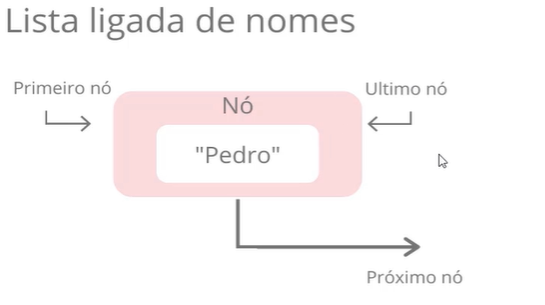
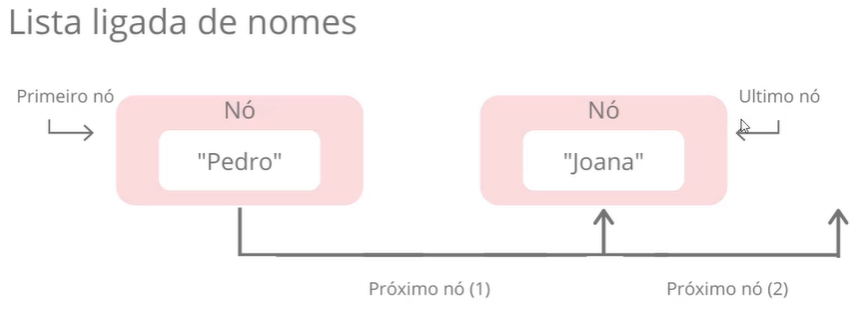
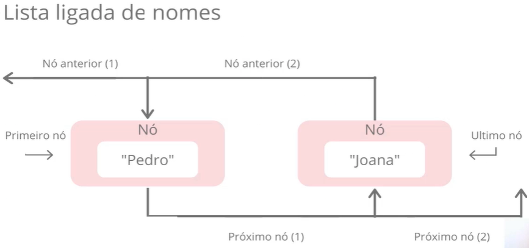
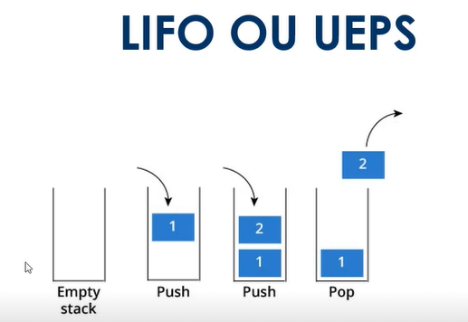
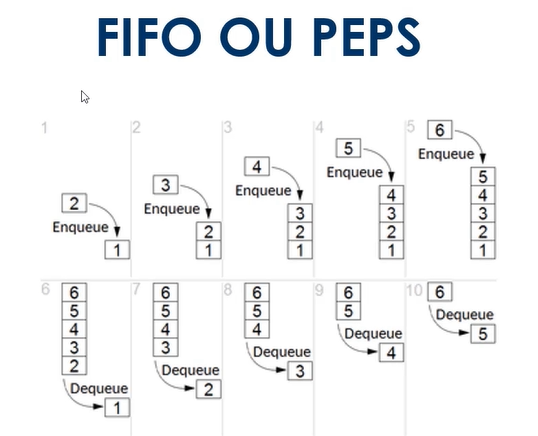
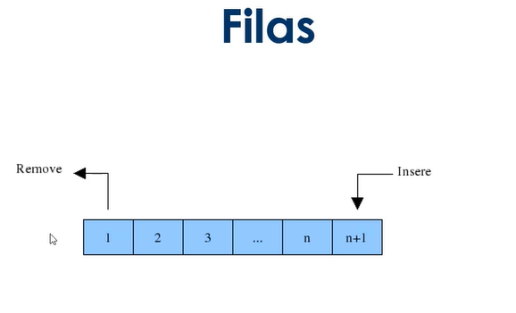
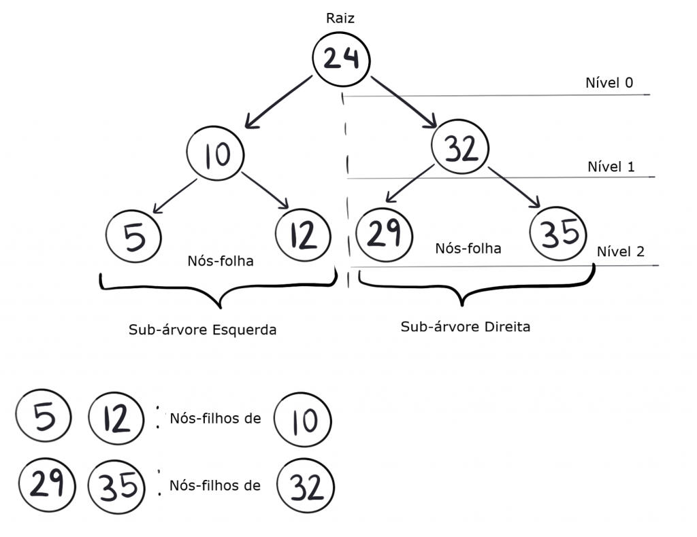
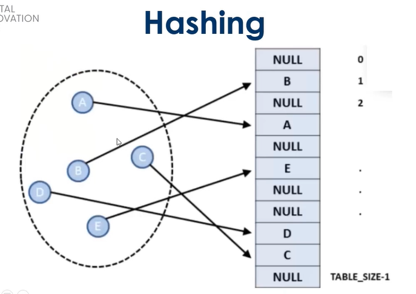
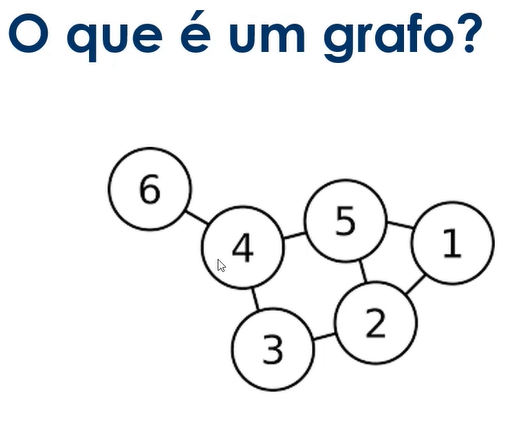
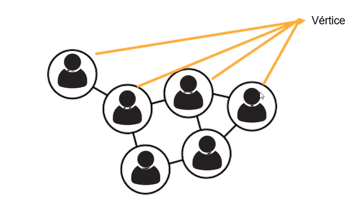

# **_Conceitos iniciais sobre estrutura de dados, arrays e registro_**

## **Introdução e objetos**
> Instrutor Bruno Dias
1. O que é estrutura de dados
2. Vetores e Matrizes
3. Registro

## **O que é estrutura de dados**

### **Estruturas de dados**

Estrutura de Dados é uma estrutura organizada de dados na memória de um computador ou em qualquer dispositivo de armazenamento, de forma que os dados possam ser utilizados de forma correta.

Essas estruturas encontram muitos aplicações no desencolvimento de sistemas, sendo que algumas são altamente especializadas e utilizadas em tarefas específicas. 

Usando as estruturas adequadas através de algoritmos, podemos trabalhas com uma grande quantidade de dados, como aplicações em bancos de dados ou serviços de busca.

### **Algoritmo**

Um algoritmo é um conjunto de instruções estruturas e ordenadas, seu objetivo é realizar uma tarefa ou operação específica.

Os algoritmos são utilizados para manipular dados nas estruturas de vários formas, como por exemplo: inserir, excluir, procurar e ordenar dados.

Em uma estutura de dados devemos saber como realizar um determinado conjunto de operações básicas, como por exemplo:

- inserir dados
- excluir dados
- localizar um elemento
- percorrer totos os itens constituintes da estruturas para visualização
- Classificar, que se resume em colocar os intes de dados em uma determinada ordem (numérica, alfabética, etc).

### **Principais estruturas de dados**
- Vetores e matrizes
- Registro
- Lista
- Pilha
- Fila
- Árvore
- Tabela Hash
- Grafos

## **Vetoress e matrizes**
### **Sobre**
Vetores e matrizes ou Arrays são estruturas de dados simples que podem auxiliar quando há muitas variáveis do mesmo tipo em um algoritmo.

https://portugol-webstudio.cubos.io/ide

Vetor ou array uni-dimensional é uma variável que armazena várias variáveis do mesmo tipo.

O vetor é uma estrutura de dados indexada, que pode armazenar uma determinada quantitdade de valores do mesmo tipo.


```portugol
programa{
    funcao inicio(){
        interiro numeros[] = {23,234,67,1234}
        escreva(numeros[0])// retotno 23, acessa a primeira posição.

        para(inteiro posicao = 0; posicao <= 3; posicao++){
            escreva(numeros[posicao]," ")//saída: 23 234 76 1234
        }
    }
}
```

```portugol

programa
{
	funcao inicio() 
	{ 
		inteiro vetor[] = { 1, 3, 5, 7, 9}  // Cria o vetor com valores pré-definidos
		inteiro numero
		logico achou = falso  // Variável para armazenar o resultado da procura

		escreva ("Qual número deseja procurar? ")
		leia (numero)

		para (inteiro posicao = 0; posicao < 5; posicao++)
		{
			se (vetor[posicao] == numero)
			{
				escreva ("Encontrado na posição: ", posicao, "\n")
				achou = verdadeiro  
			}
		}
		
		se (nao achou) 
		{
			escreva ("O número não está no vetor\n")
		}
	}
}
```

```portugol
programa
{
	funcao inicio()
	{
		// Criação dos vetores, já com os dados inicializados
		cadeia nome[] = { "Andre", "Thiago" , "Bruno", "Carlos", "Cassio" }
		real altura[] = { 1.71, 1.78, 1.75, 1.87, 1.71 }

		// Cria o cabeçalho da tabela
		escreva ("--------------------\n")
		escreva ("       TABELA       \n")
		escreva ("--------------------\n")

		/* Perocorre os vetores exibindo as informações. Note que as informações
		 * são relacionadas, colocando-as na mesmas na mesma posição em ambos os 
		 * vetores. Por exemplo, se quiséssemos incluir a idade de cada pessoa,
		 * criaríamos mais um vetor do tipo inteiro e a idade de Andre, seria 
		 * armazenada na posição 0 do novo vetor, a idade de Thiago, na posição 1, 
		 * a de Bruno na posição 2, e assim por diante.
		 */		  
		para (inteiro posicao = 0; posicao < 5; posicao++)
		{
			// O caracter especial \t serve para escrever uma tabulação
			escreva (nome[posicao], "\t\t", altura [posicao], "\n")
		}
	}
}
```
### **Sobre matrizes**

Matriz ou array multi-dimensional é um vetor de vetore. Uma matriz é um vetor que possui duas ou mais dimensões.

[1 2 3]
[4 5 3]
[3 4 4]

Exemplo de matriz em portugol:

```portugol
programa
{
	inclua biblioteca Util --> u
	
	funcao inicio()
	{
		// Define as dimensões (linhas e colunas) da matriz
		const inteiro TAMANHO = 5

		// Cria a matriz
		inteiro matriz[TAMANHO][TAMANHO] 

		para (inteiro linha = 0; linha < TAMANHO; linha++)
		{
			para (inteiro coluna = 0; coluna < TAMANHO; coluna++)
			{
				matriz[linha][coluna] = u.sorteia(1, 9) // Atribui um valor aleatório à posição da matriz
				
				escreva("[", matriz[linha][coluna], "]") // Exibe o valor contido na posição da matriz
			}
			
			escreva ("\n")
		}
	}
}
```


## **O que são registros**

### **Sobre**

Um registro é uma estrutura que fornece um formato especializado para armazenar informações em memória.

Enquanto Arrays nos permitem armazenar vários dados de um único tipo de dados, o recurso de Registro nos permite armazenar mais de um tipo de dado.

Um registro é composto por campos que especificam cada uma das informações que o compõem.

Abaixo podemos ver alguns campos de exemplo que constituem o registro de um cliente:

CPF:
Nome:
Endereço:
Contato:

Toda estrutura de registro tem um nome (ex: livro), e seus campos podem ser acessados por meio do uso do opertador ponto(.). Por exemplo, para acessar o preço de um livro, poderíamos utilizar a seguinte declaração:

livro.preco

Exemplo:

```C++
struct livro{
    char nome[30];
    float preco;
}

int main(char *args, char []argsv){
    livro = new livro;
    livro.nome = "teste";
    livro.preco = 12.2;
    return 0;
}
```


# **_Entenda o que são listas pilhas e filas_**

## **Introdução a objetos**
1. lista
2. pilhas 
3. filas

## **O que são listas**
Estrutura de Dados do tipo lista, armazena dados de um determindo tipo em uma ordem específica.

A difernça entre listas e arrays é a de que as listas possuem tamanho ajustável, enquando arrays possuem tamanho fixo.

Existem dois tipos de listas:

* Ligadas ou encadeadas
* Duplapmente ligadas ou duplamente encadeadas

### **Lista ligada ou encadeadas**

Na estrutura do tipo lista existem os nós onde cada um dos nós conhece o valor que está sendo armazenado em seu interior além de conhecer o elemento posterior a ele: por isso ela é chamada de "lista ligada", pois os nóes são amarrados com essa indicação de qual é o próximo nó.

Exemplo:




> ponteiro null 

### **Lista duplamente ligadas ou duplamente encadeadas**

As listas duplamente ligadas constituem uma variação das listas ligadas. 

A grande diferenão das listas duplamente ligadas para as listas ligadas é que elas são bidirecionads. Vimos que, naturalmente, não conseguimos "andar para trás" em listas ligadas, pois os nós de uma lista ligada sabem somente quem é o próximo elemento. Nas lists duplamente ligadas, os nós sabem quem pe o próximo elemento e também quem é o elemento anterior, o que permite a navegação reversa.




## **O que são pilhas Ou stack**
Uma pilha é uma estrutura de dados que serve como coleção de elementos, e permite o acesso a somente um item de dado armazenado.

O acesso aos itens de uma pilha é restrito - somente um item pode ser lido ou removido por vez.

### **Tipo de de Pilhas(formas de remover ou inserir)**
LIFO OU PEPS
FIFO OU UEPS

### **LIFO O UEPS**

A estrutura do tipo PILHA LIFO(Last in first out) ou UEPS(ultimo que entra primeiro que sai), apresenta o seguinte critério: o primeiro elemento a ser retirado é o último que tiver sido inserido.

### **FIFO OU PEPS**

A estrutura do tipo PILHA FIFO(first in firt out) ou PEPS(primeiro que entra parimeiro que sai),apresenta o seguinte critério: o primeiro elemento a ser retirado é o primeiro qfue tiver sifo inserido.


> empilhar e desempilhar



>empilhar e desempilhar


## **O que são filas**

A estrutura do tipo fila admite remoção de elementos e inserção de novos sujeita à seguinte regra de operação:

O elemento removido é o que está na estrutura há mais tempo ou seja, o primeiro objeto inserido na fila é também o primeiro a ser removido seguido o conceito FIFO.




# **_Estrutura de dados do tipo árvore, tabela hash e grafos_**

## **Introdução e objetivos**

## **O que são árvores**

É uma estrutura de dados que organiza seus elementos de forma hirárquica, onde existem um elemento que fiva no topo hierárquica, onde existe um elemento que fica no topo da árvore, chamada de raiz e existe os elementos subordinados a ele, que são chamados de nós ou folhas.




### **_Complemento_**

A Estrutura de dados Árvore

Uma estrutura de dados Árvore é um conjunto finito de elementos em que cada elemento é chamado nó e o primeiro elemento é chamado de raiz da árvore.

É uma estrutura de dados que organiza seus elementos de forma hierárquica, onde existe um elemento que fica no topo da árvore, chamado de raiz e existem os elementos subordinados a ele, que são chamados de nós filhos. Cada nós filho pode conter zero, um ou mais de um nós filhos. Os nós filhos que não contém outros nós filhos são chamados de nós folha.

A estrutura de dados Árvore é uma estrutura que usa ponteiros para representar os nós filhos, ou seja, trata-se de uma estrutura dinâmica.

A estruturas de dados Árvore não é linear, ou seja, os elementos que as compõem não estão armazenados de forma sequencial e também não estão todos encadeados como em uma lista.

Em uma estrutura de dados Árvore cada elemento armazena um tipo de dado e ponteiros para o elemento à esquerda e à direita, o que permite a inserção dos valores na árvore de forma recursiva.


#### **Árvores Binárias**

Considerando uma estrutura de dados Árvore com um conjunto de nós temos que considerar que esse conjunto pode ter outros subconjuntos chamados de sub-arvores que contem cada uma seu próprio conjunto de nós.

O conjunto de nós de uma árvore pode estar vazio ou ser dividido em três subconjuntos distintos, sendo eles: 1º subconjunto (nó raiz), 2º subconjunto (sub-árvore à direita) e 3º subconjunto (sub-árvore à esquerda).


- Características de uma Árvore
Raiz: Toda arvore possui o nó raiz que é o nó inicial da árvore;
Grau: o número de filhos que um nó possui;
Nível (ou profundidade): a distância de um nó até a raiz;
Altura: o maior nível encontrado na árvore (altura de uma árvore com n nós pode variar de lg(n) até n-1;
Folha: o nó que não possui filho.

- Operações em uma Árvore

Com relação às operações em árvores binárias, serão abordadas as seguintes:
Inserir um nó na árvore;
Removê-lo um nós de uma árvore;
Consultar os nós da árvore em ordem;
Consultar em pré-ordem;
Consultar em pós-ordem;

Na operação de inserção, as propriedades de uma árvore devem ser obedecidas, e todo novo nó é sempre uma folha. Além disso deve ser inserido respeitando a ordenação dos elementos dentro da árvore.

Nas operações de consulta, em ordem, pré-ordem e pós-ordem, todos os nós da árvore são listados, alterando-se apenas
sua ordem.

Na consulta em ordem, cada árvore é mostrada com o ramo da esquerda, a raiz e, posteriormente, o ramo
da direita.

Na consulta pré-ordem, cada árvore é mostrada com a raiz, o ramo da esquerda e, posteriormente, o ramo da
direita.

Na consulta pós-ordem, cada árvore é mostrada com o ramo da esquerda, o ramo da direita e, posteriormente,
a raiz.


- Árvore Binária

Uma árvore binária é um conjunto de finito de elementos que pode estar vazio ou particionado em 3 subconjuntos disjuntos.

A Raiz
A sub-arvore esquerda
A sub-arvore direita

Em uma árvore binária os nós podem assumir grau 0, 1 ou 2;

Em uma árvore binária completa, todos os nós possuem grau igual a 2;

O número máximo de elementos em uma árvore de altura n é 2n.

- Árvore binária de busca

Uma árvore binária de busca possui elementos menores que a raiz armazenados na sub-árvore da esquerda e elementos maiores que a raiz na sub-árvores da direita.

- Árvore binária como um TDA

Podemos representar uma árvore binária como um tipo abstrato de dados com as seguintes características:

• Conjunto de elementos;
• Raiz para indicar o 1º elemento inserido
• Cada elemento deve indicar os seus descendentes

- Operações em uma árvore binária

• Inserir novo elemento
• Buscar um elemento
• Mostrar todos os elementos
• Remover um elemento
• Contar elementos
• Calcular nível de um elemento

- Inserção de elementos em uma árvore binária de busca

• O primeiro elemento inserido assumirá o papel de raiz da árvore;
• Todo novo elemento entrará na árvore como uma folha;
• Se o elemento for menor ou igual à raiz será inserido no ramo da esquerda. Caso contrário, no ramo da direita (para árvores decrescentes inverte-se a a regra).

- Remoção de elementos em uma árvore binária de busca

Considerando que podemos remover qualquer elemento de uma árvore, podem ocorrer as seguintes situações:

1. O Elemento a ser removido é um nó folha (sem filhos à esquerda e à direita);
2. O Elemento a ser removido possui apenas um filho (à direita ou à esquerda);
3. O Elemento a ser removido possui dois filhos.

- Percurso em uma árvore binária

1. Pré-ordem: raiz, sub-árvore esquerda, sub-árvore direita
2. Em ordem: sub-árvore esquerda, raiz, sub-árvore direita
3. Pós-ordem: sub-árvore esquerda, sub-árvore direita, raiz

Exemplo de um programa que implementa uma árvore binária

O exemplo abaixo mostra as operações básicas em uma árvore binária. Este exemplo deve ser usado como modelo para os exercícios com estrutura de dados árvore.
```C++
#include <stdio.h>
#include <stdlib.h>

typedef struct arvoreBinaria {
    int elem;
    struct arvoreBinaria *dir, *esq;
} arvoreBinaria;

arvoreBinaria* insere(arvoreBinaria *a, int el);
arvoreBinaria* remover(arvoreBinaria *a, int el);
void preOrdem(arvoreBinaria *a);
void emOrdem(arvoreBinaria *a);
void posOrdem(arvoreBinaria *a);

int main() {
    struct arvoreBinaria *raiz, *p;
    int x; char op;
    raiz = NULL;

do {
    fflush(stdin);
    printf("\n1- Inserir\n2- Excluir \n3-preOrdem \n4- emOrdem\n5- posOrdem \n6- Sair ");
    scanf("%c", &op);

    switch (op) {

        case '1':
            printf("\nValor? ");
            scanf("%d", &x);
            raiz=insere(raiz,x);
            break;

        case '2':
            if (raiz != NULL) {
                printf("\nDigite um valor ");
                scanf("%d", &x);
                raiz=remover(raiz,x); }
                else printf("\nArvore vazia.\n");
                break;

        case '3':
            preOrdem(raiz);
            break;

        case '4':
            emOrdem(raiz);
            break;

        case '5':
            posOrdem(raiz);
        } // fim switch
    }while (op!= '6');
}

arvoreBinaria* insere(struct arvoreBinaria *a, int el) {

if (a == NULL) {
    a = malloc(sizeof(struct arvoreBinaria));
    a->elem = el;
    a->esq = NULL;
    a->dir = NULL;
    printf("\nInserido. ");
}
else {
    if (el <= a->elem)
      a->esq=insere(a->esq, el);
   else
      a->dir=insere(a->dir, el);
}
return a;
}

arvoreBinaria *remover(arvoreBinaria *a, int el) {
    arvoreBinaria *p, *p2;
    if (a->elem == el) {
        if (a->esq == a->dir) {
            // remoção de folha
            free(a);
            return NULL;
        }
else
     if (a->esq == NULL) { //filho a direita
        p=a->dir;
        free(a);
        return p;
    }
    else if (a->dir == NULL) { //filho a esq
        p=a->esq;
        free(a);
        return p;
    }
    else { //tem 2 filhos
        p2= a->dir;
        p= a->dir;
        while (p->esq) p=p->esq;
            p->esq = a->esq;
        free(a);
        return p2;
    }
}
if (a->elem < el) {
    if (a->dir!=NULL)
        a->dir = remover(a->dir, el);
else
        printf("Elemento nao encontrado.");
}
else {
    if (a->esq!=NULL)
        a->esq = remover(a->esq, el);
    else
        printf("Elemento não encontrado");
}
return a;
}

void preOrdem(arvoreBinaria *a) {
    if (a != NULL) {
        printf("\n%d ", a->elem);
        preOrdem(a->esq);
        preOrdem(a->dir);
    }
}

void emOrdem(arvoreBinaria *a) {
    if (a != NULL) {
        emOrdem(a->esq);
        printf("\n%d ", a->elem);
        emOrdem(a->dir);
    }
}

void posOrdem(arvoreBinaria *a) {
    if (a != NULL) {
        posOrdem(a->esq);
        posOrdem(a->dir);
        printf("\n%d ", a->elem);
    }
}
```
## **O que são tabelas hash**

Uma tabela hash, de dispersão ou espalhamento é uma estrutura de dados especial, que associa chaves de pesquisa a valores.

### **Hashing**

Uma tabela hash é uma generalizaão da idéia de array, porém utiliza uma função denominada hashing para espalhar os elementos, fazendo com que os mesmo fique de forma não ordenada dentro do "array" que define a tabela.



#### **Por que espalhar**

A tabela hash permite a associação de "valores" a "chaves"

- Valoeres: é a posição ou índice onde o elemento se encontra.
- Chave: parte da informação que compõe o elemento a ser manipulado.

Espalhar facilitra a busca na estrutura de dados, pois a partir de uma chave podemos acessar de forma rápida uma posição do "array".

## **O que são grafos**

Grafos são estruturas que permite programar a relação entre objetos.

Os objetos são vértices ou "nós" do grafo.

Os relacionamentos são as arestas.


> Forma de grafo


>Rede social estruturação dos dados armazenados(informações dos usuários são os nós e as arestas são as ligações que determina as relações de amizade entre usuários).
